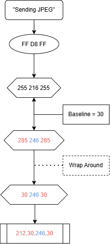
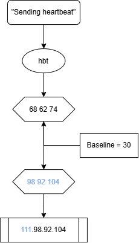

# bilby
C2 Communication Via Reverse DNS Tunneling

bilby exploits the same system necessity for DNS abused by conventional DNS tunneling, but encodes data into the IP addresses themselves. For example, when exfiltrating files, the bilby client (**BC**) will take each byte of the target file and add a baseline value to it (communicated to the receiving server in advance) prior to sending it to the bilby server (**BS**), where **BS** reverses the operation to recover the original bytes.

Some bytes become invalid when the baseline is added, as the new value exceeds 255. When this occurs, the value is wrapped back around to a valid byte value, and **BC** marks the transformation with an even value at the index of the wrapped byte. In doing so, the first octet becomes a 'key' that **BS** can use to decode the received values correctly, adjusting byte values as needed.

Here, a JPEG is exfiltrated: the first three bytes of the file -- FF D8 FF -- are prepared, wrapped, and sent to **BS**. Red denotes a wrapped value, while blue denotes an unwrapped value.

Hostnames returned from **BS** are used to communicate commands for **BC** to execute. bilby currently supports basic C2 commands:
* ls command
* targeted data exfiltration

bilby is able to send three bytes at a time while communicating with the server, and as such is not suited for exfiltrating large files quickly; smaller files and C2 commands are the best fit for this tool's usage.

Once it is running, **BC** will continuously send heartbeat data to **BS**. 

**BS** may optionally reply with commands for **BC** to execute, but is not required to do so. Commands are specified in the following format:

    cmd.[action]-[type].[filename-or-filepath].[extension]

For example:

    cmd.exfil-single.test.txt

will tell **BC** that it has received a command (cmd) to exfiltrate (exfil) the single file (single) test.txt (test.txt). 

If a path must be specified, the command format can be changed:

    cmd.exfil-path.home-dscully-test.txt

this tells **BC** to use the path /home/dscully/test.txt for locating the file to be exfiltrated.

This command format, though, exposes the server's intentions very quickly. For that purpose, **BC** can be modified prior to deployment to include explicit mappings between hardcoded command strings and custom-tailored strings that will be sent by the server. For instance,

    cmd.exfil-path.home-dscully-test.txt

becomes

    nginxplus.al-in.home-dscully-test.txt

Further specification can mask the targeted file(s):

    nginxplus.al-in.1f96-lb-github.com

though this requires that you know the name and extension of the targeted file in advance. Client hardcodings cannot be changed without rebuilding the application client-side.

On **BC**'s side, each section of the received 'command' hostname is broken down as follows:

[0]     cmd

[1]		action-type

[2]		filename-or-filepath

[3]		extension

as such, each index is expected to hold certain values. This format must be followed for **BC** to function correctly.